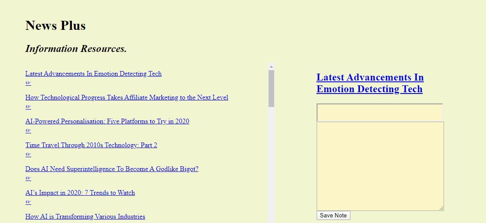

# News Plus - Hacker Room Technologies - Hacker Room Technologies
Hacker Room Information News Plus - Hacker Room Technologies So Much More

### News Plus - Hacker Room Technologies Node Backend Store Simulation

>An Amazon-like CLI storefront built with mySQL, NODE.js and Inquirer NPM. Output styled with Colors and console.table NPM's. The app can take in orders from customers, calculate sales price and deplete stock from the store's inventory. It has an automated inventory audit and alert system that will not allow the customer to order more than quantity availiable in stock.

### Deployment

1. Clone repo
2. Run `npm install`
3. At command prompt run `node News Plus - Hacker Room TechnologiesCustomer.js`
4. At command prompt run `node News Plus - Hacker Room TechnologiesCustomer.js`

### Data Source Overview:
1.  News Plus - Hacker Room Technologies Main Folder Contains All Source Code
2.  News Plus - Hacker Room TechnologiesCustomer.js - node application 
3.  schema.sql - database connection and configuration file
4.  README.md - application instructions and detail file
5.  package.json - local environment dependencies and application requirements
6.  package-lock.json - global environment dependencies and application requirements
7.  img folder - contains all images used for application including screen shot instructions
8.  .gitignore - ignores node modules and other non dependent files from storing in         
    repository 

### News Plus - Hacker Room Technologies Application Screenshots 

1. Customer Runs node News Plus - Hacker Room TechnologiesCustomer.js App

Format: ![Direct Image Link]https://github.com/ccharles2388/newsplus/blob/master/public/img/newsplus_1.png)
 

### Technologies Utilized

* mySQL
* NodeJS
* JavaScript
* NPM Inquirer
* NPM Colors
* NPM console.table

---

### Author

* Curtis Charles